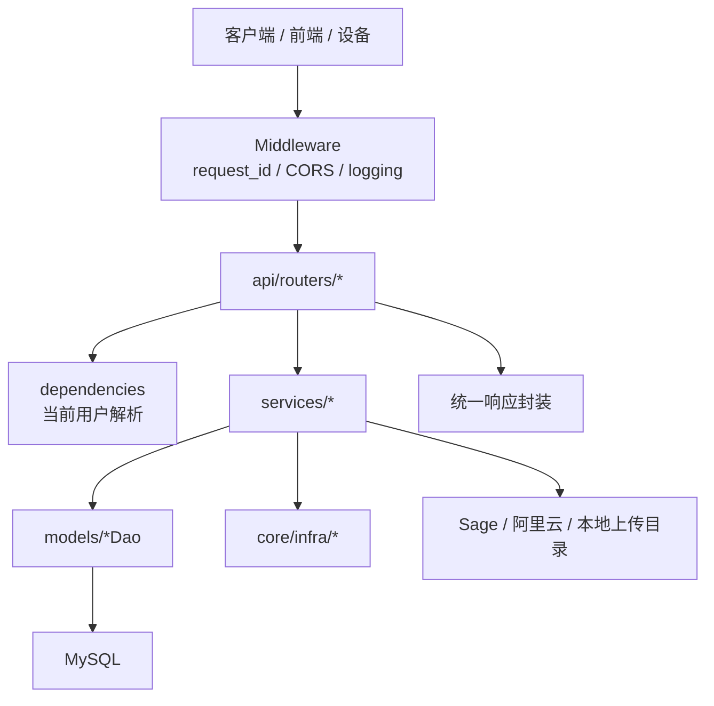

# app 后端架构说明

## 1. 目标与定位

`app/` 是 ling 项目的后端应用，基于 FastAPI 提供 HTTP API、MCP 接入、业务编排和数据持久化能力。

当前代码采用的是一套清晰的分层结构：

- `api/` 负责 HTTP 路由与接口边界
- `services/` 负责业务规则、流程编排和外部服务调用
- `models/` 负责领域模型与 DAO 持久化
- `core/` 负责 HTTP 基础设施与底层资源
- `config/` 负责配置装配
- `utils/` 负责日志和路径等工具能力

它更接近“按技术层分层、按业务域聚合”的后端结构，适合当前中小规模单体服务继续演进。

## 2. 技术栈

- Web 框架：FastAPI
- 运行入口：Uvicorn
- 数据访问：SQLAlchemy Async
- 数据库：MySQL
- 鉴权：JWT Access Token + Refresh Token
- 日志：Loguru
- 网络访问：httpx
- 文件上传：FastAPI `UploadFile`
- MCP：FastMCP
- 外部平台：阿里云号码认证、阿里云邮件、Sage Agent 平台

## 3. 目录总览

```text
app/
├── main.py                  # 应用入口，组装 FastAPI、MCP、路由、静态资源
├── lifecycle.py             # 应用生命周期，负责资源初始化和关闭
├── api/
│   ├── router.py            # 顶层路由聚合，统一挂载到 /ling-api
│   ├── mcp.py               # MCP HTTP 应用与工具注册
│   └── routers/             # 各业务域路由
├── services/
│   ├── auth/                # 认证与邮箱验证码相关服务
│   ├── agent/               # Agent 会话、附件、Sage 客户端
│   └── calendar.py          # 日历业务服务
├── models/
│   ├── base.py              # Base、BaseDao、通用 CRUD 能力
│   ├── user.py              # 用户、用户配置、外部身份
│   ├── auth.py              # 短信挑战、刷新令牌
│   ├── calendar.py          # 日历事件、Apple 映射、上下文
│   └── agent.py             # Agent 会话、消息记录
├── core/
│   ├── http/                # 中间件、鉴权、异常、响应规范、请求上下文
│   └── infra/               # DB、资源初始化、阿里云能力适配
├── config/
│   └── settings.py          # AppConfig 与环境变量解析
├── schema/                  # Schema 预留层，当前内容较轻
└── utils/                   # 日志、路径等基础工具
```

## 4. 总体分层



### 分层职责

#### 4.1 API 层

`api/routers/*` 负责：

- 接收请求参数
- 做接口级参数校验
- 通过依赖注入拿到当前用户
- 调用 Service
- 返回统一格式响应

这一层整体比较薄，业务逻辑没有堆在路由函数里，职责边界清晰。

#### 4.2 Service 层

`services/*` 是核心业务层，负责：

- 聚合多个 DAO 完成业务流程
- 组织外部服务调用
- 构造 Agent 运行上下文
- 处理账号、日历、会话等领域规则

当前最核心的服务包括：

- `AuthService`
- `CalendarService`
- `calendar_integrations/*`
- `AgentService`
- `AttachmentService`

#### 4.3 Model/DAO 层

`models/*` 以“实体 + DAO”的方式组织：

- 实体类负责表结构定义
- DAO 负责通用 CRUD 和领域查询
- `BaseDao` 提供统一的异步访问模式

这使业务层可以直接面向 `UserDao`、`CalendarEventDao`、`AgentSessionDao` 这样的语义化接口，而不是散落 SQL。

#### 4.4 Core 层

`core/` 存放跨业务复用的基础设施：

- `core/http/` 解决接口层共性问题
- `core/infra/` 解决数据库与外部资源初始化问题

它们不承载某一个业务域，而是服务整个后端应用。

## 4.5 事务开发规范

当前后端的标准事务写法已经统一为：

- Service 层负责定义事务边界
- DAO 层只负责执行读写，不自行定义跨业务事务
- 多步数据库写操作必须运行在同一个事务中
- Redis、S3、本地文件、第三方回调等数据库外副作用必须放在事务提交成功之后

推荐写法：

```python
from core.infra.db import transaction_scope

async with transaction_scope() as session:
    await self.user_dao.save(user, session=session)
    await self.identity_dao.save(identity, session=session)
```

如果当前方法已经运行在上层事务里，需要继续参与同一个事务，写法如下：

```python
from core.infra.db import transaction_scope

async def bind_identity(..., session: AsyncSession | None = None):
    async with transaction_scope(session) as active_session:
        await self.user_dao.save(user, session=active_session)
        await self.identity_dao.save(identity, session=active_session)
```

具体约束：

- 不要在 Service 层手写 `commit()` / `rollback()` / `close()` 样板代码，统一交给 `transaction_scope()` 和 `SessionManager.transaction()`
- 不要在需要原子性的业务流程里串联多个“默认 autocommit DAO 调用”
- DAO 方法统一使用可选参数 `session: AsyncSession | None = None`
- 如果确实只是单条简单写入，并且不需要和其他操作保持原子性，可以不传 `session`，沿用兼容的自动提交行为
- 需要在事务内提前拿到数据库约束结果或主键可见性时，使用当前事务的 `await session.flush()`，不要提前提交
- 一个业务事务内的查询也应该复用同一个 `session`，保证读写视图一致
- 外部副作用失败时不要回滚已经提交成功的数据库事务，应走补偿或异步清理逻辑

不推荐写法：

- 在 DAO 内部自行开启跨步骤事务
- 在 Service 层为每个 DAO 调用单独开一个数据库 session
- 先发放权益、再补写幂等记录
- 事务未提交前先删 Redis Token、删文件、发事件或调用外部系统

## 5. 业务架构

当前后端可以分成 4 个主要业务域。

### 5.1 认证与账号域

路由入口：

- `api/routers/auth.py`

核心能力：

- 短信验证码登录
- 邮箱验证码登录
- 阿里云一键登录换号
- Access Token / Refresh Token 签发与刷新
- 当前用户资料查询
- 用户偏好配置更新
- 手机号 / 邮箱绑定
- 账号注销与关联数据清理

核心对象：

- `User`
- `UserConfig`
- `UserExternalIdentity`
- `RedisAuthStateStore`

业务特点：

- 统一由 `AuthService` 编排
- 登录方式虽然有多种，但都汇聚到本地用户模型和 `local` provider 身份体系
- 短信 challenge、邮件验证码、Refresh Token 状态统一存放在 Redis
- 注销账号时会级联删除用户相关的日历、Agent、身份、令牌、上传文件等数据

### 5.2 日历域

路由入口：

- `api/routers/calendar.py`
- `api/routers/integrations.py`

核心能力：

- Ling 内部日历事件 CRUD
- 按日视图、周视图、月视图读取
- Apple 本地日历事件映射关系保存
- 设备上报的 Apple 日历上下文保存
- 为 Agent 组装未来一段时间的日历上下文

核心对象：

- `CalendarEvent`
- `CalendarEventLink`
- `AppleCalendarContext`

业务特点：

- Ling 自有事件和 Apple 设备侧事件是两套数据
- `CalendarEventLink` 用来建立 Ling 事件与 Apple 本地事件的映射
- `AppleCalendarContext` 用来保存设备上报的窗口期日历快照
- Agent 不直接查询 Apple 日历，而是消费设备已同步回来的上下文
- 第三方 OAuth 日历接入（Feishu / DingTalk）由 `services/calendar_integrations/` 负责

第三方日历部署与联调说明见：

- [`docs/第三方日历接入说明.md`](../docs/第三方日历接入说明.md)

### 5.3 Agent 助手域

路由入口：

- `api/routers/agent.py`

核心能力：

- Agent 会话创建与查询
- 会话消息历史读取
- 对接 Sage 平台进行流式对话
- 记录用户输入与助手流式返回消息
- 上传图片附件
- 语音转文本兜底处理

核心对象：

- `AgentSession`
- `AgentMessage`

业务特点：

- `AgentService` 负责会话状态与消息持久化
- `SageClient` 负责真正与外部 Agent 平台通信
- 流式接口返回 `text/event-stream`
- 每次发起对话前，会先把用户输入落库，再将返回 chunk 持续落库
- Agent 会融合 Ling 日历和 Apple 日历上下文，形成更完整的助理视角

### 5.4 平台接入与健康域

路由入口：

- `api/routers/health.py`
- `api/mcp.py`

核心能力：

- 健康检查
- 暴露 MCP HTTP 应用
- 提供基础 MCP Tool（当前有 `echo` 示例）

业务特点：

- 健康检查会带出 `startup_error` 与 `request_id`
- MCP 当前是轻量接入点，后续可以逐步扩展为后端能力的工具化出口

## 6. 典型业务流

### 6.1 登录流

```text
客户端请求验证码
-> AuthService 生成 challenge 或发送邮件
-> 客户端提交验证码
-> AuthService 校验 challenge / 邮件码
-> 获取或创建本地用户
-> 补齐 external identity
-> 生成 access_token + refresh_token
-> 返回用户资料与身份信息
```

### 6.2 Agent 对话流

```text
客户端创建会话
-> 服务端生成 AgentSession
-> 客户端发起 stream 请求
-> 服务端补充 timezone / selected_date
-> CalendarService 组装日历上下文
-> SageClient 发起流式请求
-> 返回 chunk 给客户端
-> 同步持久化 AgentMessage
```

### 6.3 日历同步流

```text
客户端维护 Ling 日历事件
-> 后端保存 CalendarEvent
-> 设备把 Apple 日历快照回传
-> 后端保存 AppleCalendarContext / EventLink
-> Agent 请求时统一读取 Ling + Apple 两侧上下文
```

## 7. 公共组件

这一部分是后端可复用能力的核心。

### 7.1 配置中心

位置：

- `config/settings.py`

职责：

- 统一读取环境变量
- 提供 `AppConfig`
- 归一化 `logs_dir`
- 管理 MySQL、Redis 与外部平台接入配置

说明：

- `get_app_config()` 负责按需读取缓存配置
- `init_app_config()` 通常在启动阶段初始化
- 应用配置既承载运行参数，也承载第三方接入参数

### 7.2 生命周期管理

位置：

- `main.py`
- `lifecycle.py`

职责：

- 启动时初始化配置
- 初始化数据库、邮件、号码认证等共享资源
- 应用关闭时统一释放资源

说明：

- 生命周期挂在 FastAPI `lifespan`
- 启动失败不会让进程直接崩掉，而是记录到 `startup_error`
- `health` 接口可见启动状态

### 7.3 HTTP 基础设施

位置：

- `core/http/middleware.py`
- `core/http/dependencies.py`
- `core/http/auth.py`
- `core/http/exceptions.py`
- `core/http/render.py`
- `core/http/context.py`
- `core/http/user_context.py`

职责：

- 请求级 `request_id` 注入
- 统一访问日志
- CORS 配置
- JWT 解析与当前用户注入
- 统一异常输出
- 统一响应体结构
- 请求上下文 / 用户上下文透传

统一响应格式：

```json
{
  "code": 200,
  "message": "success",
  "data": {},
  "timestamp": "2026-03-31T00:00:00+00:00"
}
```

统一价值：

- 前端只需处理一种成功/失败返回协议
- 排障时可以通过 `request_id` 串联日志和接口返回
- 权限控制集中在依赖层，而不是重复散落在每个路由里

### 7.4 数据库基础设施

位置：

- `core/infra/db.py`
- `models/base.py`

职责：

- 管理异步 SQLAlchemy Engine 与 Session
- 管理 MySQL 连接与会话
- 在启动时自动建表
- 检测缺失字段并尝试 `ALTER TABLE ADD COLUMN`
- 提供通用 `BaseDao` CRUD 能力
- 提供数据库异常重试与统一错误包装

说明：

- 对当前项目来说，`BaseDao + 领域 Dao` 的方式已经足够高效
- 自动补列机制降低了开发期模型调整成本
- `get_session()` 对取消场景和流式请求做了保护

### 7.5 外部平台适配器

位置：

- `core/infra/pns.py`
- `core/infra/eml.py`
- `services/agent/sage.py`

职责：

- 封装阿里云号码认证
- 封装阿里云邮件发送
- 封装 Sage Agent 流式调用

设计特点：

- 业务层不直接面向 SDK，统一通过适配器访问
- 配置缺失、SDK 未安装、远程调用失败时，都会转换为应用内统一异常
- 对上层来说，外部平台和本地持久化的调用方式保持一致

### 7.6 文件与静态资源能力

位置：

- `services/agent/attachments.py`
- `main.py`

职责：

- 保存 Agent 图片上传
- 对话图片附件使用 S3 对象存储

说明：

- 上传文件按 `agent_images/<user_id>/` 分目录存放
- 返回值里直接给出可访问的相对下载路径，方便客户端回显

### 7.7 日志体系

位置：

- `utils/log.py`

职责：

- 初始化控制台和文件日志
- 将标准 logging 重定向到 Loguru
- 在日志中自动注入 `request_id`

说明：

- 控制台默认输出 `INFO`
- 文件日志保留更完整的 `DEBUG`
- 对 FastAPI / Uvicorn 的日志也做了统一接管

## 8. 主要数据模型

从领域视角看，当前数据库模型可以分为三组；短信挑战和刷新令牌状态已经迁移到 Redis，不再落库。

### 8.1 用户与身份

- `users`
- `user_configs`
- `user_external_identities`

用于保存用户基础资料、偏好配置和登录标识映射。

### 8.2 日历与设备同步

- `events`
- `calendar_event_links`
- `apple_calendar_contexts`

用于保存 Ling 日历事件、Apple 事件映射关系和设备侧日历上下文。

### 8.3 Agent 会话与消息

- `agent_sessions`
- `agent_messages`

用于保存 Agent 会话状态和流式消息轨迹。

## 9. 当前架构特点总结

### 优点

- 入口清晰，启动链路简单
- 路由层足够薄，业务逻辑主要在 Service 层
- 公共 HTTP 能力和业务能力分离良好
- 数据模型围绕业务域划分，命名直观
- 对第三方平台做了适配层封装，后续替换成本较低
- 对 Agent、日历、账号三条主线有比较自然的组合点

### 当前约定

- 业务逻辑优先放在 `services/`
- 持久化查询优先下沉到 `models/*Dao`
- 共享 HTTP 能力统一放到 `core/http/`
- 共享资源和 SDK 适配统一放到 `core/infra/`
- `schema/` 目录已预留，但当前请求模型主要仍定义在路由文件中

## 10. 后续演进建议

如果后端继续扩大，可以优先沿着下面几个方向演进：

1. 将 `schema/` 真正启用，逐步把路由里的请求/响应模型外提，降低 router 文件体积。
2. 按业务域继续细化 service，例如把日历同步、月视图、Agent 上下文拼装拆成更小的领域服务。
3. 为 `services/agent` 和 `services/auth` 增加更明确的接口协议或 DTO，减少跨层传裸字典。
4. 当业务继续扩展时，可以从“技术分层”平滑过渡到“业务域分包”，例如 `modules/auth`、`modules/calendar`、`modules/agent`。
5. 增补更细粒度的 observability，例如外部调用耗时、数据库指标、SSE 流式对话追踪。

---

如果要快速理解后端，建议按下面顺序阅读源码：

1. `main.py`
2. `lifecycle.py`
3. `api/router.py`
4. `api/routers/auth.py` / `calendar.py` / `agent.py`
5. `services/auth/auth.py` / `calendar.py` / `agent/service.py`
6. `models/*.py`
7. `core/http/*.py` 与 `core/infra/*.py`
